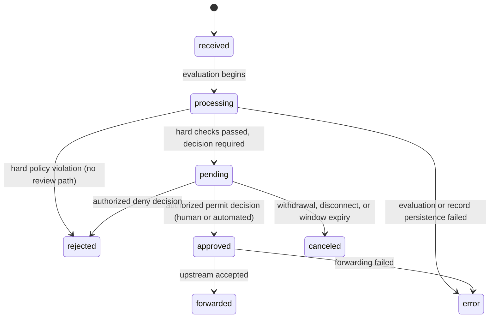

# Push Lifecycle and Approval State Machine

Applies to implementations claiming **Class A**. Conformance keywords per
BCP 14 (`00-overview.md`).

## 1. Terminology

- **push submission** — one attempt by a Git client to update one or more
  refs in one upstream repository through the proxy.
- **lifecycle record** — the record that tracks a single push submission
  from receipt to a terminal state. Its persistence mechanism is
  non-normative; its observable content is not.
- **canonical state** — one of the eight states defined in §2.
- **terminal state** — a canonical state with no legal outgoing
  transitions.
- **deciding actor** — the authority behind a decision, of actor type
  `automated` (policy evaluated by the system) or `human` (an
  authenticated reviewer).
- **attestation** — structured evidence attached to a decision: deciding
  actor identity, actor type, timestamp, and decision-specific content (a
  reason for denial/cancellation; completed attestation content for
  approval).
- **hard policy violation** — a policy outcome configured to deny without
  human review.
- **reviewable submission** — a submission that passed all hard checks and
  requires a decision before it may be forwarded.

## 2. Canonical states

| State        | Meaning                                                                                      | Terminal |
| ------------ | -------------------------------------------------------------------------------------------- | -------- |
| `received`   | Submission accepted for evaluation; nothing yet decided                                      | no       |
| `processing` | Policy evaluation in progress                                                                | no       |
| `pending`    | Reviewable submission awaiting a decision                                                    | no       |
| `approved`   | A decision to permit exists; upstream transfer not yet complete                              | no       |
| `forwarded`  | Upstream accepted the submission                                                             | yes      |
| `rejected`   | Denied — by policy or by a reviewer                                                          | yes      |
| `canceled`   | Resolved without a decision on the content: withdrawn, client gone, or review window expired | yes      |
| `error`      | The submission could not be processed safely; fail-closed                                    | yes      |

State names are lowercase in normative text. Internal representation is
non-normative — an enum, a set of flags, or anything else — provided LC-1
holds.

## 3. Legal transitions

| From         | To           | Trigger                                                                       | Required evidence on the record                                       |
| ------------ | ------------ | ----------------------------------------------------------------------------- | --------------------------------------------------------------------- |
| _(start)_    | `received`   | submission accepted for evaluation                                            | submission metadata (repository, refs, submitter identity, timestamp) |
| `received`   | `processing` | evaluation begins                                                             | —                                                                     |
| `processing` | `rejected`   | hard policy violation                                                         | automated attestation: violated rule(s), reason                       |
| `processing` | `pending`    | all hard checks passed                                                        | evaluation results (per-check outcomes)                               |
| `processing` | `error`      | evaluation could not complete, or the lifecycle record could not be persisted | error cause                                                           |
| `pending`    | `approved`   | authorized decision to permit (reviewer attestation, or auto-approval policy) | attestation; `automated` actor type when auto-approved                |
| `pending`    | `rejected`   | authorized decision to deny                                                   | attestation with reason                                               |
| `pending`    | `canceled`   | withdrawal by an authorized actor, client disconnect, or review-window expiry | attestation with reason; `automated` actor type for disconnect/expiry |
| `approved`   | `forwarded`  | upstream accepted the transfer                                                | upstream result                                                       |
| `approved`   | `error`      | forwarding to upstream failed                                                 | error cause                                                           |

## 4. Requirements

**LC-1** — A conforming implementation MUST be able to report, for every
push submission, exactly one canonical state at any point in time, via its
policy/audit interface. The mapping from internal representation to
canonical state MUST be total and unambiguous.

**LC-2** — An implementation MUST NOT expose any state transition other
than those in §3.

**LC-3** — A push submission MUST NOT reach the upstream unless its
lifecycle record is in `approved` at the moment forwarding begins. A
submission in `rejected`, `canceled`, or `error` MUST NOT reach the
upstream.

**LC-4** — A hard policy denial (`processing` → `rejected`) MUST be
observably distinct from a deferral (`processing` → `pending`), both to the
Git client and on the lifecycle record. An implementation in which "failed
a check" and "awaiting review" cannot be told apart from outside does not
conform.

**LC-5** — Every transition into `rejected` or `canceled` MUST record an
attestation carrying the deciding actor's type (`automated` or `human`)
and a human-readable reason. This includes system-generated cancellations
(disconnect, expiry), whose reason MUST state the mechanism.

**LC-6** — Every transition into `approved` MUST record a structured
attestation carrying the deciding actor, actor type, and timestamp. An
approval produced by policy carries the `automated` actor type.

**LC-7** — A submission MUST NOT remain `pending` indefinitely. An
implementation MUST enforce a bounded review window; on expiry the
submission transitions to `canceled` with an automated attestation
recording the timeout.

**LC-8** — An implementation MUST NOT accept an approval whose deciding
actor is the submission's own submitter, unless an explicit override
entitlement — granted out of band, scoped at minimum to the repository —
permits it. Every exercise of such an override MUST be identifiable as
such in the attestation.

**LC-9** — Fail closed. (a) If the lifecycle record cannot be created, or
cannot be read at decision time, the submission MUST be denied. (b) A
forwarding failure after approval MUST transition the record to `error`,
carrying the upstream failure cause. (c) `error` is terminal; recovery is
a new submission, not a resurrected record.

**LC-10** — Every transition MUST be recorded with a timestamp and its
trigger, such that the full path of a submission through §3 can be
reconstructed after the fact from the audit interface alone.

## 5. State diagram (informative)

States with no outgoing edges are the terminal states of §2; explicit
final-state edges are omitted for legibility. Evidence requirements per
transition are normative in §3–§4, not in this diagram.

## Appendix A (non-normative) — representation mappings

**Enum representation.** A per-record status enum maps 1:1 onto the
canonical states (e.g. `RECEIVED` → `received`, `PROCESSING` →
`processing`, and so on). LC-1 is satisfied trivially.

**Flag representation.** A record carrying orthogonal booleans (e.g.
`blocked`, `error`, `rejected`, `authorised`, `canceled`) can satisfy LC-1
only if the derivation to a canonical state is total and unambiguous —
including `pending`, which in such representations is typically the
_absence_ of every terminal flag plus a waiting marker. The derivation
function is part of the implementation's conformance claim and must be
documented. A single flag covering both "denied by a check" and "awaiting
review" cannot satisfy LC-4, since the two are not derivable from it.

## Appendix B (non-normative) — proposed extension: structured findings and per-finding exemptions

Not implemented by any known implementation; recorded here as a proposed
extension per the derivation rule (`01`, §9 — product features do not
qualify for the aspirational carve-out).

The idea: `pending` may carry `findings[]` (severity, rule, evidence) from
soft-fail policy checks — e.g. a secret scanner hit on a known test
certificate. Approving a submission with unresolved findings would require
a per-finding **exemption attestation** (who, why, scope: this submission
only vs. a standing waiver), making the exemption itself a first-class
audit object. The `processing` fork then becomes a severity threshold
rather than a binary: rules the organization marks non-overridable go
straight to `rejected`; everything else defers with findings attached.

Promotion path: this appendix becomes normative when a reference
implementation ships it.

## Appendix C (non-normative) — conformance test priorities

A conformance suite should cover first the requirements whose verification
depends on observing complete decision paths from outside: LC-4 (distinct
hard-fail vs. deferral), LC-5 (attestation on every denial and
cancellation), LC-7 (bounded review window), LC-8 (self-approval
override).

Internal working note — remove before any publication

Gap analysis against finos/git-proxy at `origin/main` 790f7535
(2026-08-09): `blocked` overloaded for both check-failure and
awaiting-review (LC-4); no review-window timeout, pending waits
indefinitely (LC-7); `/cancel` route captures no reason (LC-5);
self-approval check is a binary admin bypass rather than a scoped
entitlement (LC-8). Both `autoRejected` and `Rejection.automated` exist,
so LC-5's actor-type requirement is already representable there. Keep this
analysis internal per the finos-tone rule; the neutral text above carries
everything the spec needs.

## Appendix D (non-normative) — open issues

- **Unconsumed approvals.** `approved` is non-terminal. In the
  reject-and-retry deferral model (`03`), an approval the client never
  returns to consume currently lives forever. Should approvals expire
  (transitioning to `canceled` with an automated reason)? Should they be
  single-use? Cross-cutting with `03` DF-9/DF-10.
- **Edge transitions.** Is `received` → `error` needed (record created,
  evaluation never started)? Is `received` → `canceled` needed (client
  disconnects mid-transfer)? The table currently says no; confirm against
  implementation behaviour before freezing.
- **Name normativity.** Are the canonical state _names_ themselves
  normative for API interchange (a conforming API must literally say
  `pending`), or only the semantics plus a documented mapping? The audit
  portability goal argues for literal names; decide when drafting the
  record field sets.
