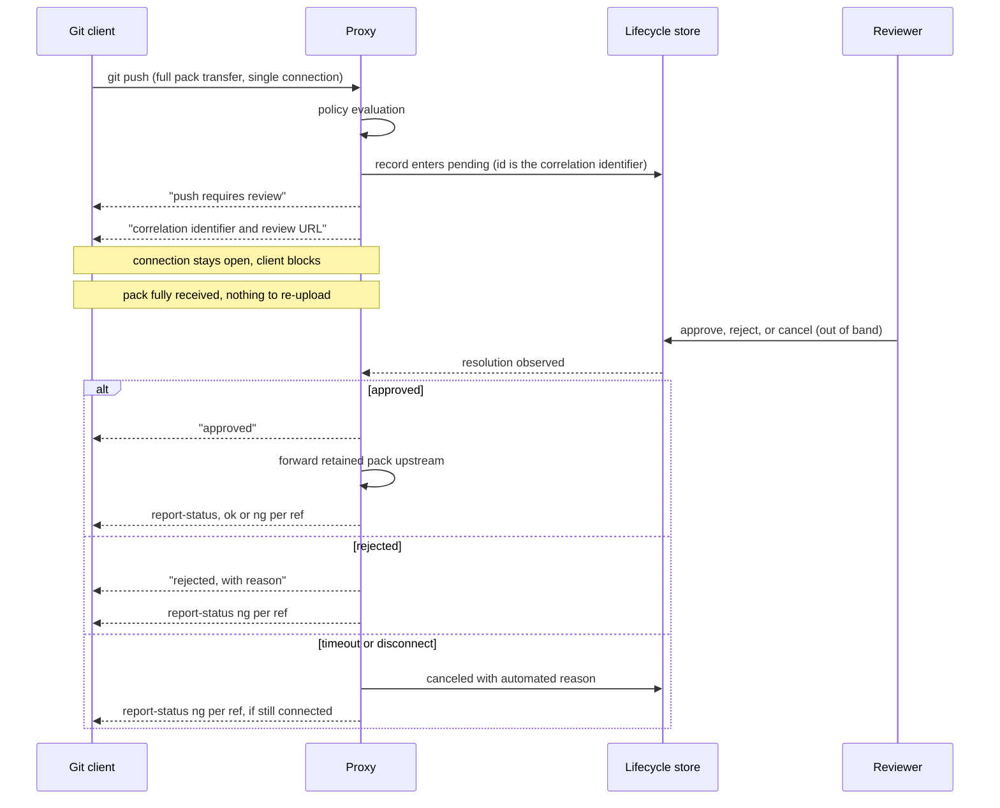
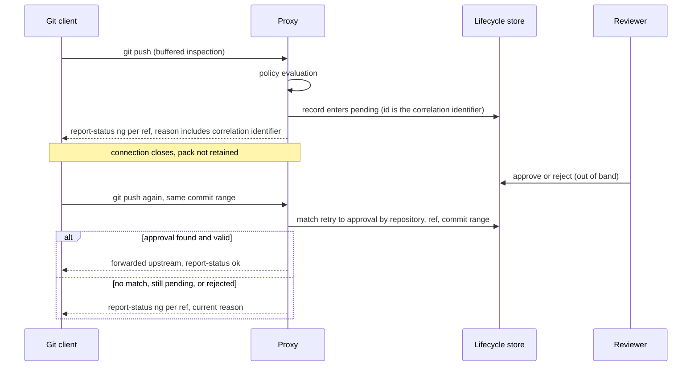

# Deferral Interaction Models

Git-over-HTTP is stateless, and a held-for-approval push is stateful. This
section defines two models for bridging that gap and what each guarantees
on the wire (`01` §5.6). Applies to **Class A** implementations that defer
submissions. Conformance keywords per BCP 14 (`00-overview.md`).

## 1. Terminology

- **deferral** — the event in which a reviewable submission enters
  `pending` (see `02`) instead of being immediately forwarded or denied.
- **review window** — the bounded period a submission may remain
  `pending` (`02` LC-7).
- **resolution** — the transition of a deferred submission out of
  `pending`.
- **retry** — a subsequent push of the same commit range by the client,
  intended to consume an approval granted after deferral.
- **correlation identifier** — the stable identifier of the lifecycle
  record, by which the client-visible deferral, the review action, and the
  audit trail refer to the same submission.

## 2. The two models

**Model H — held connection.** The proxy takes full possession of the pack,
keeps the client connection open for the duration of the review window, and
resolves the push synchronously on that connection: approval forwards the
retained pack upstream with no client re-upload; denial reports the refs
rejected.

**Model R — reject and retry.** The proxy records the submission, rejects
the refs in the initial response, and closes the connection. Review happens
offline. The client re-pushes after approval; the retry is matched to the
recorded approval and forwarded.

The models make opposite trade-offs. Model H gives live progress and a
single client interaction, at the cost of long-held connections and
instance affinity. Model R preserves statelessness and horizontal
scalability, at the cost of a second client interaction and a retry
re-identification problem.

**DF-1** — A conforming implementation MUST implement at least one model,
MAY implement both, and MUST document which model applies to each endpoint
or mode it serves.

## 3. Requirements common to both models

**DF-2** — Deferral MUST be signalled to the Git client as well-formed
protocol output — sideband progress and/or `report-status` — never as a
transport hang, silent timeout, or connection reset (`01` §5.5).

**DF-3** — The client-visible deferral notice MUST include the correlation
identifier, and SHOULD include a URL at which the submission can be
reviewed.

**DF-4** — Resolution MUST follow the lifecycle in `02`: every deferral
outcome is one of `approved` (then `forwarded`/`error`), `rejected`, or
`canceled`, with the evidence those transitions require.

**DF-5** — For the same submission, both models MUST produce equivalent
outcomes as seen by the reviewer and the auditor. The model governs the
client interaction only; the policy result and the audit trail are
identical either way.

## 4. Model H requirements

**DF-6** — The pack MUST be fully received and retained before the review
window opens. Forwarding on approval MUST NOT require the client to
re-upload objects.

**DF-7** — The implementation SHOULD monitor client liveness during the
wait. A detected disconnect resolves the submission to `canceled` with an
automated attestation; the pack MUST NOT be forwarded on behalf of a
client known to be gone. (A deliberate deferred-forwarding capability —
parking the push for later forwarding with appropriate credential handling
— is a distinct feature outside this section's scope.)

**DF-8** — On review-window expiry the submission resolves to `canceled`
per `02` LC-7; the implementation MUST report the refs as rejected to the
client and SHOULD state the timeout as the reason if the client is still
connected.

## 5. Model R requirements

**DF-9** — The initial response MUST reject the refs via `report-status`
(`ng <ref> <reason>`), with a reason that satisfies DF-3.

**DF-10** — An approval MUST be consumable only by a retry targeting the
same repository, ref, and commit range for which it was granted. A retry
to any other repository or ref MUST NOT consume the approval. Without
repository scoping, an approval for one repository can be replayed against
another whose branch tip matches.

**DF-11** — The implementation MUST define and document its retry
re-identification method. Matching on the exact commit range is the
baseline: an amended or rebased retry produces different commit IDs and is
a **new submission**, entering evaluation from `received`; it MUST NOT
consume the prior approval.

## 6. Sequence diagrams (informative)

### Model H — held connection

### Model R — reject and retry

## 7. Open issues

- **Machine-readable deferral.** Both models tell the client "denied for
  now" using the same `ng` mechanism as final rejection, distinguished
  only by message text. Should the spec define a structured, parseable
  component of the reason (correlation identifier at minimum) so tooling
  can distinguish "retry after approval" from "do not retry"?
- **Correlation on retry.** Model R re-identifies by content (repository,
  ref, commit range) rather than requiring the client to present the
  correlation identifier. Should presenting the identifier be an
  alternative or required mechanism? Content matching is zero-friction but
  breaks on amend/rebase by design (DF-11); identifier presentation would
  need a client-side convention the protocol doesn't naturally offer.
- **Approval lifetime.** Single-use vs. reusable, and expiry of unconsumed
  approvals — shared with `02` Appendix D.
- **Model H scaling.** A held connection pins the review wait to one proxy
  instance. Whether the spec should say anything about resolution
  observation across instances (shared store polling vs. notification) or
  stay silent as internal architecture — likely the latter, but the
  instance-affinity consequence deserves a non-normative note.
- **SSH parity.** Model H maps naturally onto SSH (the channel stays open;
  sideband works identically). Model R's `report-status` behaviour is
  transport-neutral, but denial semantics differ on SSH (`01` §5.4).
  Confirm both models specify cleanly for both transports before freezing.

