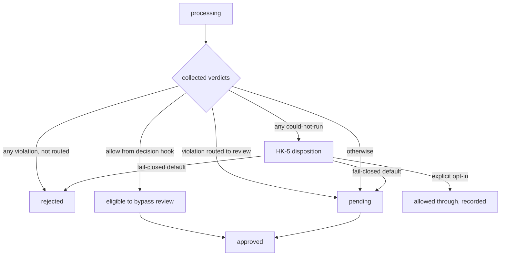

# Policy Decision Contract

Applies to implementations claiming **Class A**. Conformance keywords per
BCP 14 (`00-overview.md`). Requirement IDs: `HK-n`.

Defines how a policy decision is reached and expressed, in two layers:

- **§3 — the decision-point contract**: the semantics every policy check
  observes and returns, independent of the mechanism that runs it.
- **§4 — the external decision protocol**: an optional wire protocol for
  delegating a decision to a process outside the intermediary.

## 1. Terminology

- **decision point** — a place in evaluation (`02` `processing`) where a
  policy verdict is produced: a built-in check, an in-process extension,
  or an external delegate.
- **check** — a decision point that inspects submission content and
  reports whether it satisfies a rule.
- **verdict** — the outcome a decision point returns (§3.2).
- **finding** — structured evidence attached to a verdict: rule
  identifier, severity, and a locator into the submission; a finding MUST
  be redaction-safe (`04` §2.3).
- **disposition** — the lifecycle transition (`02` §3) the set of
  verdicts produces for the submission as a whole.
- **decision host** — the intermediary component that invokes decision
  points, collects verdicts, and applies the disposition. The host is
  implementation-internal; the contract below is what it MUST guarantee
  to and require of a decision point.

## 2. Why two layers

A decision point running inside the intermediary is reached through a
programming interface, which this specification does not constrain
(`01` §7 — internal structure is not observable). What it constrains is
the _contract_: what the decision point is guaranteed to receive, what it
is permitted to return, and how the host treats each return. That
contract is observable — it is verifiable by submitting pushes and
observing dispositions — and is specified in §3.

A decision point running _outside_ the intermediary is reached over a
wire protocol, which is fully observable and therefore specifiable end to
end. That protocol is optional and specified in §4.

## 3. The decision-point contract (normative)

### 3.1 Guaranteed inputs

**HK-1** — When a decision point is invoked, the decision host MUST make
available a read-only view of the submission comprising at least: the
submission `id`, the canonical repository identity (`01` §6.2), the
target ref and the old/new object ids, the submitter's presented and
(where resolved) upstream identity, and the commit content the push
introduces (`04` §2.2), including annotated tag objects (`01` §5.9).

**HK-2** — A decision point MUST NOT require, as a condition of running,
any transport-specific artifact (an HTTP request object, a servlet
context, a connection handle). The guaranteed inputs of HK-1 are the
whole of its required environment. A contract that can only be satisfied
by presenting transport machinery forces every transport and mode to
reconstruct that machinery, and is non-conforming.

HK-2 is what lets one decision point serve every transport and mode: the
same check runs unchanged under a store-and-forward pre-receive chain and
a transparent-proxy filter chain.

### 3.2 Verdict vocabulary

A verdict is exactly one of:

| Verdict         | Meaning                                                                                             |
| --------------- | --------------------------------------------------------------------------------------------------- |
| `pass`          | The submission satisfies this decision point's rule                                                 |
| `violation`     | The submission breaks the rule; carries at least one finding                                        |
| `could-not-run` | The decision point could not reach a conclusion (dependency unavailable, misconfiguration, timeout) |
| `defer`         | The submission requires human review before it may proceed                                          |
| `allow`         | The submission may proceed without human review                                                     |

**HK-3** — A decision point is granted authority over a subset of the
vocabulary, fixed by its role and known to the host:

- A **check** returns `pass`, `violation`, or `could-not-run`. It reports
  on content; it does not decide routing.
- A **decision hook** additionally may return `defer` or `allow`. It is
  granted routing authority.

A decision point MUST NOT return a verdict outside its granted subset;
the host MUST reject one that does as `could-not-run`.

### 3.3 Disposition

**HK-4** — The host MUST derive the submission's disposition from the
collected verdicts by these rules, which MUST be observable in the
outcome:

- Any `violation` with no overriding `allow` → `rejected` (`02`), unless
  the violation is routed to review by policy, in which case → `pending`.
- Any `could-not-run` → the could-not-run disposition of HK-5.
- An `allow` from an authorized decision hook → eligible to bypass review
  (subject to LC-8 self-approval and LC-6 attestation).
- Otherwise → `pending`.

**HK-5** — The disposition of `could-not-run` MUST be an explicit,
recorded policy decision, never an implicit default of the decision
point. A conforming implementation MUST default `could-not-run` to
fail-closed — `rejected` or `pending`, never silent `pass` — and MAY
permit an operator to configure a fail-open disposition per decision
point as an explicit, visible opt-in. Whichever disposition applies, the
`could-not-run` verdict MUST be recorded as such on the push record
(`04` §2.3), distinct from both `pass` and `violation`.

### 3.4 Accumulation and determinism

**HK-6** — The host MUST support running every applicable check and
collecting all verdicts before determining disposition, so that a
submission's full set of findings can be reported at once. The host MAY
also short-circuit on a verdict a decision point marks as terminal; which
decision points are terminal is host configuration, not a property the
submission can influence.

**HK-7** — A decision point MUST be free of side effects that alter the
submission or the evaluation of other decision points. Its only output is
its verdict and findings. (Redaction of stored evidence is a host
responsibility, not a decision-point side effect — `01` §5.10 retention,
`04` §5.)

### 3.5 Ordering guarantees

**HK-8** — The host MUST guarantee that parsing, identity resolution, and
commit enrichment (the inputs of HK-1) are complete before any decision
point runs. Where an implementation admits extension decision points, it
MUST guarantee they run after the built-in decision points that establish
those inputs, and MUST NOT allow an extension to run before the
submission has been parsed. The relative order among independent checks
is not observable and not constrained.

## 4. The external decision protocol (normative when offered)

An implementation MAY delegate a decision to a process outside the
intermediary. When it does, the delegation MUST use the protocol below,
so that a delegate written against this specification is portable across
implementations.

### 4.1 Binding

**HK-9** — The external decision protocol is HTTP with a JSON request and
response body.

### 4.2 Request

**HK-10** — The intermediary MUST send, as the request body, a JSON
object carrying the HK-1 guaranteed inputs plus the protocol version. The
field set is the push record projection of `04` restricted to the HK-1
inputs; the intermediary MUST NOT include the client's authorization
material (`01` §5.10) in the request.

### 4.3 Response

**HK-11** — The delegate MUST respond with a JSON object carrying a
verdict from the §3.2 vocabulary permitted to its granted role, and, for
a `violation`, at least one finding. A response the intermediary cannot
parse, or that carries a verdict outside the delegate's granted role, MUST
be treated as `could-not-run`.

### 4.4 Failure policy

**HK-12** — A delegate that does not respond within a configured bound, or
that is unreachable, MUST be treated as `could-not-run` and subjected to
the HK-5 disposition (fail-closed by default). An external delegate MUST
NOT be able to fail open by being switched off or made unreachable.

### 4.5 Versioning

**HK-13** — The request MUST carry the protocol version. A delegate that
does not support the version MUST be treated as `could-not-run`, not
silently skipped.

## 5. Verdict-to-lifecycle mapping (informative)

## 6. Open issues

- **`allow` authority and self-approval.** A decision hook returning
  `allow` bypasses review; this intersects LC-8 (self-approval) and the
  attestation requirement LC-6. What attestation does an automated
  `allow` produce, and can a hook's `allow` ever satisfy a control that
  would otherwise require a human? Needs an explicit position.
- **Finding locator format.** HK findings carry "a locator into the
  submission." Whether that is a normative structured form (path + line,
  object id + offset) or free text affects whether findings are portable
  across implementations. Undecided.
- **Request body size.** Large pushes produce large HK-10 request bodies.
  Whether the protocol streams, paginates, or bounds the content given to
  an external delegate is unspecified.
- **Delegate identity and integrity.** The protocol says nothing yet
  about authenticating the intermediary to the delegate or vice versa, nor
  about protecting submission content in transit to an external process.
  Required before the protocol is safe to publish.

Internal working note — remove before any publication

Derivation, 2026-08-15, fogwall `main` vs finos/git-proxy `origin/main`.

**Layer 1 — internal contract. Both implement; different quality.**

fogwall (`validation/CommitCheck`, `DiffCheck`): pure functions.
`CommitCheck.check(List<Commit>) -> List<Violation>`;
`DiffCheck.check(String) -> Optional<List<Violation>>`. No transport
type in the signature; documented as reused unchanged by the JGit
pre-receive chain (S&F) and the servlet filter chain (transparent). This
is the preferred model and the source of HK-1/HK-2. The
error-vs-violation split is real and implemented: `ValidationContext`
has `addIssue(...)` (error=false, policy violation) vs `addError(...)`
(error=true, could-not-run) — sourced HK-5 and the tri-state. Finding
redaction-safety sourced from `ContentPatternFinding` (matchedText must
route through redaction) and `Violation`.

git-proxy (`processors/types.ProcessorExec`): `(req: Request, action:
Action) => Promise<Action>`. Coupled to the Express `Request`; mutates a
shared `Action` god-object (adds `Step`, sets `blocked`/`error`/
`autoApproved`/`autoRejected`). Consequence, confirmed in the SSH path:
every non-HTTP transport fakes a Request/Response to feed the chain — the
exact failure HK-2 forbids. Discard: the request-coupling and in-place
mutation. Keep: `isCollectible` (accumulate-all-failures vs
short-circuit) → sourced HK-6; `displayName` step naming → already in
`04`.

**fail-open tension.** fogwall's `DiffCheck` documents `Optional.empty()`
as fail-OPEN (scanner unavailable → push allowed + warning). This
conflicts with a strict reading of `04` §6.1 / LC-9. Resolved neutrally
in HK-5: could-not-run defaults fail-closed, fail-open is a permitted
explicit per-check opt-in. Do not call fogwall's default wrong in spec
text; encode the principle. (fogwall may want to revisit the DiffCheck
default independently — its own #308 policy-exception model is the natural
home. Not raised as an issue this session.)

**Layer 2 — external hook. Only git-proxy; local subprocess, not HTTP.**

git-proxy `processors/push-action/preReceive.ts`: `spawnSync` of
`./hooks/pre-receive.sh`, stdin = `commitFrom commitTo branch`, verdict
by exit code — 0 approve, 1 reject, 2 manual-review, other error;
Unix-only; `isCollectible = true`. The transport (local shell subprocess)
is not portable and not spec-able; the _verdict vocabulary_ is, and
sourced §3.2's `allow`/`violation`(reject)/`defer`(review)/`could-not-run`
four-way and HK-3's routing-authority split (a hook can route, a check
cannot). fogwall has NO external decision hook — `GitleaksRunner` shells
out to the scanner but that is a check dependency, not a delegated
decision. So §4's HTTP+JSON is greenfield for both; verdict semantics are
git-proxy prior art, generalized off the shell binding.

Keep this comparison internal per the functional-register /finos-tone
rules; §§1-6 above carry only functional statements.

